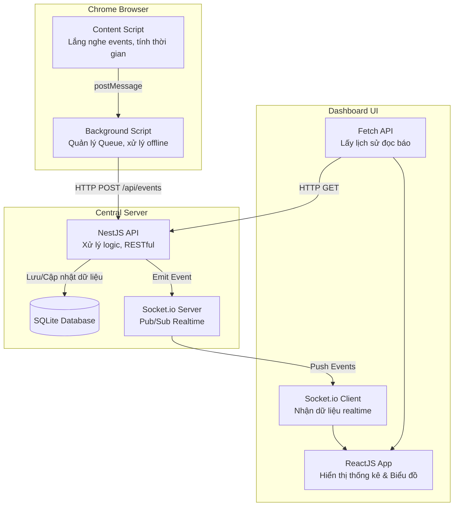

# Hệ Thống Thu Thập, Lưu Trữ Và Phân Tích Hành Vi Đọc Tin Tức của User trên Chrome.

# Instructions for installing and running the system.
# Download link git
## 1. Chrome Extension (Thư mục `extension/`)

Source (vnexpress.net, dantri.com.vn, tuoitre.vn).

- **Install:**
  1. Mở Chrome, truy cập `chrome://extensions/`.
  2. Bật chế độ **Developer mode** (góc trên bên phải).
  3. Nhấn **Load unpacked** và chọn thư mục `extension` trong dự án này.
- **Tính năng nổi bật:**
  - Lắng nghe các event (scroll, mousemove, keydown) kết hợp với `Page Visibility API` để theo dõi chính xác thời gian đọc thực tế.
  - Sử dụng cơ chế hàng đợi (queue) và `chrome.storage.local` để lưu trữ event khi mất mạng và tự động đồng bộ khi có mạng lại.
  - Bắt sự kiện người dùng đóng tab đột ngột qua Background script (`chrome.tabs.onRemoved`).

## 2. Central Server (Thư mục `server/`)

- **Run:**
  1. Mở terminal, truy cập thư mục `server/`.
  2. Chạy lệnh: `npm install`
  3. Khởi động server: `npm run start:dev`
     (Server sẽ chạy tại `http://localhost:3000`)
- **API:**
  - `POST /api/events`: Nhận event từ Extension, lưu vào SQLite (xử lý trùng lặp bằng `event_id`).
  - `GET /api/sessions`: Lấy danh sách phiên đọc báo, phục vụ thống kê tổng thời gian.
  - `GET /api/articles`: Truy xuất dữ liệu các bài báo đã đọc.
  - Tích hợp `Socket.io` đẩy thông báo realtime khi có event mới.

## 3. Dashboard (Thư mục `dashboard/`)

- **Run:**
  1. Mở terminal, truy cập thư mục `dashboard/`.
  2. Chạy lệnh: `npm install`
  3. Khởi động ứng dụng: `npm run dev`
     (Dashboard sẽ chạy tại `http://localhost:5173`)

## Tech & tools

- **Frontend:** React, TailwindCSS, Chart.js, Socket.io-client.
- **Backend:** NestJS, TypeORM, SQLite, Socket.io.
- **Extension:** Chrome Manifest V3, Content script, Background script.
- **Database:** SQLite.
- **Luồng dữ liệu:** `Content Script` -> Lắng nghe hành vi -> Gửi message -> `Background Script` -> Call API POST -> `NestJS Server` -> Save `SQLite` -> Emit Event `Socket.io` -> `React Dashboard` Update UI.

## Features

- Dashboard: Liệt kê các bài báo đã đọc, tính toán tổng thời gian thực tế bằng cách nhóm theo `session_id`. Biểu đồ hình tròn (Pie chart) hiển thị tổng thời gian đọc theo Domain. Timeline hiển thị luồng sự kiện được cập nhật realtime (qua Socket.io).
- Extension: Thu thập URL, Title, Content trên 3 trang web được chỉ định. Tính toán thời gian đọc thực tế (Scroll, visibility, idle 30s). Xử lý queue local khi mất mạng, xử lý khi đóng tab đột ngột.
- RESTful API (lưu sự kiện vào SQLite), xử lý trùng lặp event (idempotency key), đẩy Real-time (Socket.io).

## Hạn chế

- Extension đang dùng query selector tĩnh (phụ thuộc vào DOM HTML của báo).
- Cần tối ưu truy vấn Group By ở Backend khi lượng dữ liệu phình to.
- Dashboard giao diện còn ở mức MVP, chưa có tính năng export báo cáo hay lọc theo ngày tháng.

## Quyết định kỹ thuật

- Lưu dữ liệu dạng Event Log (Time-series) thay vì cập nhật 1 bản ghi duy nhất.
- Dùng Background Service Worker làm Proxy / Queue để tránh mất dữ liệu khi rớt mạng.
- Sử dụng SQLite và TypeORM để dễ test (chỉ cần npm install và npm run start) nhưng vẫn sẵn sàng scale lên MySQL/PostgreSQL.

## Kiến trúc hệ thống

Hệ thống được thiết kế theo mô hình Client-Server kết hợp luồng xử lý dữ liệu theo thời gian thực (Realtime), bao gồm 3 khối thành phần chính:

### Luồng hoạt động (Data Flow)

1. **Thu thập dữ liệu (Content Script):** Khi người dùng truy cập các trang báo mục tiêu, Content Script được inject vào trang. Nó lắng nghe các tương tác của người dùng (`scroll`, `mousemove`, `keydown`) và trạng thái hiển thị (`visibilitychange`) để theo dõi hành vi và tính toán thời gian đọc thực tế.
2. **Xử lý trung gian (Background Script):** Content Script đẩy dữ liệu sang Background Script. Tại đây, dữ liệu được đưa vào một hàng đợi (Queue) sử dụng `chrome.storage.local`. Cơ chế này đóng vai trò như một proxy cục bộ, giúp lưu trữ tạm sự kiện khi mất kết nối mạng và tự động đồng bộ (sync) lên server ngay khi có mạng trở lại.
3. **Lưu trữ dữ liệu (Central Server):** Background Script gửi dữ liệu về Server qua HTTP API (`POST /api/events`). NestJS Server tiếp nhận, xác thực, xử lý chống trùng lặp dữ liệu (sử dụng `event_id`), và lưu vào cơ sở dữ liệu SQLite theo dạng chuỗi thời gian (time-series event log).
4. **Cập nhật Dashboard (Realtime):** Mỗi khi có sự kiện mới được lưu thành công, Server dùng Socket.io để phát thông báo (emit). Dashboard (xây dựng bằng React) liên tục lắng nghe và nhận sự kiện này, từ đó tự động cập nhật lại các chỉ số, timeline, và biểu đồ hiển thị mà không cần người dùng làm mới trang.
